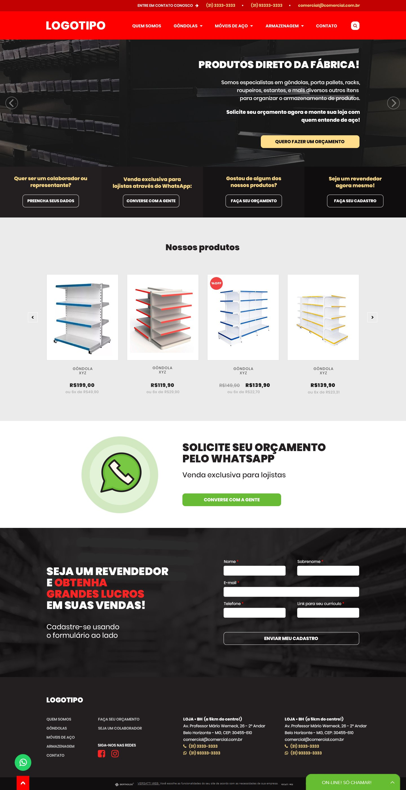

# Projeto
    
Criar uma página conforme layout abaixo

## Requisitos do projeto

- Responsividade
- Os banners devem ser rotativos.
- As fontes utilizadas no projeto foram:
- Menu: Georgia Regular
- Títulos, Destaque e Rodapé: Roboto Thin
- Botões: PT Sans Narrow Bold
- Valor do produto: Open Sans Bold

### Cores

- header #c20102
- navbar #fe0000
- menu gradiente #231f20 #1f1b1c, #161415 , #0f0d0e
- body #ebebeb
- mapa do site #231f20
- footer #100e0f
- fale conosco #66bd32

## Skills utilizadas

- HTLM5
- CSS3
- Bootstrap
- Jquery

## Imagens últilizadas

Foi usada a API do site unsplash.com para randomizar as imagens.

- https://source.unsplash.com/700x70/?store